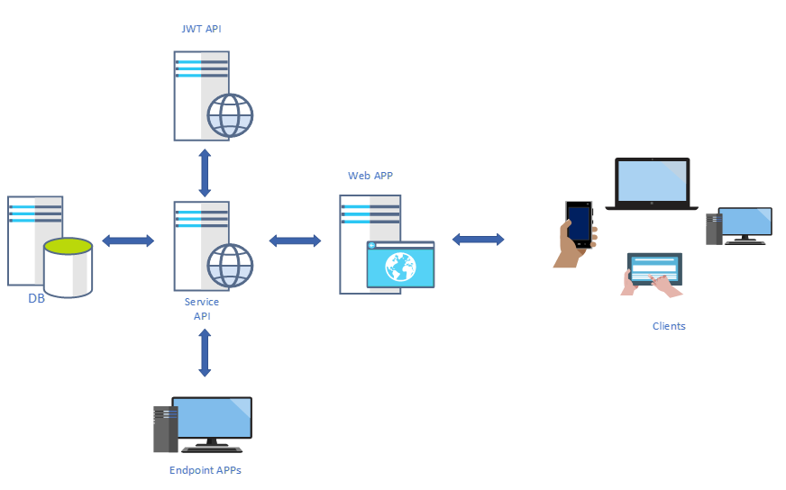

# GuizzySeguridad - RESIDENCIAL

Sistema de administración para un conjunto hacitacional.

TODO: Agregar mas descripción del proyecto en general.

## ARQUITECTURA GENERAL

Vista general de como fuciona la solución a nivel arquitectura.



## ESTRUCTURA DEL REPOSITORIO

Este proyecto tiene la siguietnte de archivos para organizar mejor el código.

```typescript
project
│   README.md
│   JenkisFile.groovy
│   .gitignore
│
└─── docs
│   │   Authentication.md
│   │
│   └───img
│
└─── src
│   │
│   └─── Api
│   │
│   └─── Database
│   │
│   └─── Web
│   │
│   └─── Mobile
│   │
│   └─── Gate
```

## CÓDIGO DE LA SOLUCIÓN

| Proyecto |      Tecnología                                          |                  ¿Cómo Usar?                       |
|----------|:--------------------------------------------------------:|:--------------------------------------------------:|
| Api      |  .net Framework 4.8, .net standar 2.0, ASP MVC API 2     | [Ver documentación API](docs/Project-Api.md)       |
| Web      |  Typescript ES5, Angular 8                               | [Ver documentación Web](docs/Project-Web.md)       |
| Database |  SQLPackage, Dacpacks                                    | [Ver documentación DB](docs/Project-Db.md)         |
| Mobile   |  Xamarin.Forms 4, .net standar 2.0                       | [Ver documentación Mobile](docs/Project-Mobile.md) |
| Gateway  |  TODO: Añadir mas información                            | [Ver documentación Gate](docs/Project-Gate.md)     |
