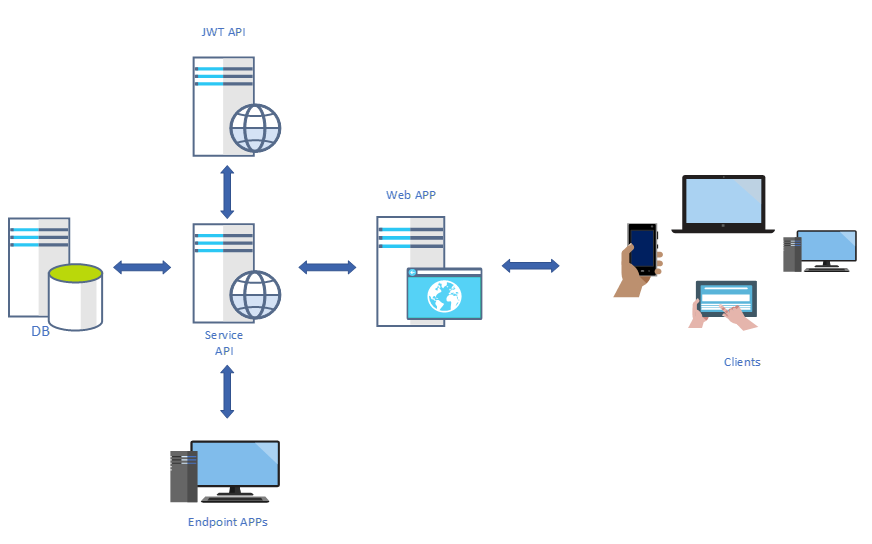
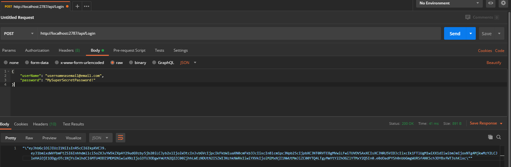
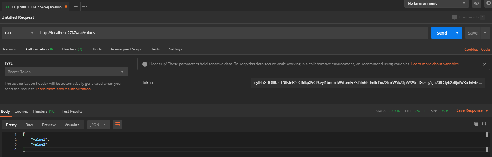
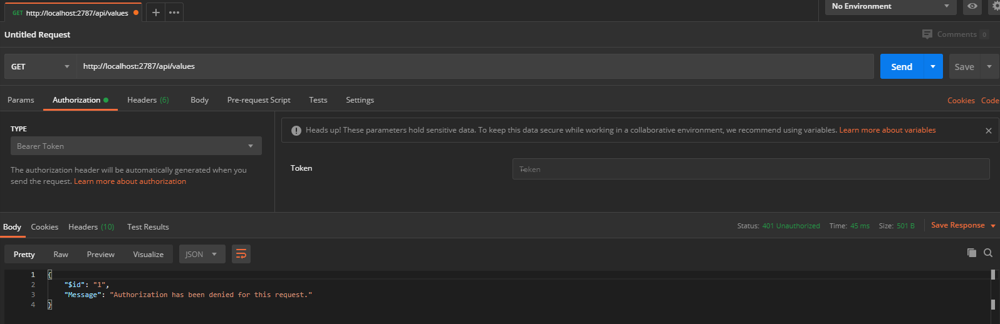

# Dawsoncreep - RESIDENCIAL

Sistema de administración de visitas en conjunto hacitacional.

TODO: Agregar mas descripción del proyecto.

## DESCRIPCIÓN DE LOS PROYECTOS

TODO: Agregar una descripción general de lo que se continen en esta soluciuón.

* Authentication.Api: Proyecto 'Web Api' para la autenticacion de usuarios usando [_Json Web Tokens__]("https://jwt.io/").

* ServicesClient: Proyecto 'Web Api REST' para el consumo de datos a traves de las aplicaicones cliente.  

TODO: Agregar la descripcion de los demas proyectos.

## ARQUITECTURA GENERAL

Vista general de como fuciona la solución a nivel arquitectura.




## AUTENTIFICACIÓN Y AUTORIZACIÓN

Esta solucion utiliza [_Json Web Tokens__]("https://jwt.io/") tanto para la autentificación como la autorización de sus usuarios.

Para la correcta autenticacion de un usuario, tanto las aplicaciones finales (_EndPoint Apps_) como los usuarios de la aplicación web deben pedir la generación de un __token__ que les permitirá utilizar recursos miestras se termina el periodo de validez del mismo.

Para generar un token de autentificacion se debe generar una peticion **HTTP POST** a la siguiente direccion del _Service API_, **_~/api/Login_**. Dentro del cuerpo (*body*) de la petición debe ir adjunto en formato**Json** la peticion del inicio de session utilizando la siguiente estructura:

```json
{
    "userName": "usernameasemail@email.com",
    "password": "MySuperSecretPassword!"
}
```

### EJEMPLO DE USO

Aqui un ejemplo de generacion de un JWT utilizando [PostMan]("https://www.postman.com/"):



Aqui un ejemplo de validacion exitosa de un JWT utilizando [PostMan]("https://www.postman.com/"):



Aqui un ejemplo de validacion incorrecta de un JWT utilizando [PostMan]("https://www.postman.com/"):



### ESTUCTURA DEL TOKEN

Una vez validado el usuario, el token resultante contiene la información necesaria que las aplicaicones destino pueden utilizar para hacer valer sus propósitos. Una de las propiedades que pudiera interesar es la de **rol**, adjunto al nombre del usuario acutal, el token tiene una propiedad llamada rol, la cual contine todos los roles y permisos que el usuario en cuestion possee dentro del sistema, en este punto las aplicaciones finales pueden hacer uso de esta información para ejectar diversos flujos de negocio.

El token contine la siguiente estructura:

```json
{
  ...
  
  "unique_name": "usernameasemail@email.com",
  "role": "[{\"role\":\"Administrador\",\"permission\":[\"MODULO 1\",\"MENU 1\",\"MENU 2\",\"MENU 3\"]}]",
  "nbf": 1588290366,
  "exp": 1588297566,
  "iat": 1588290366,
  "iss": "957880be-7d6d-4f8a-a345-7b9eb778d5dd",
  "aud": "3c16255e-2bbd-4a48-822f-cfa8fea31cd9",  

  ...
}
```

## OTRO APARTADO

TODO: Agregar los apartados que crean convenientes.